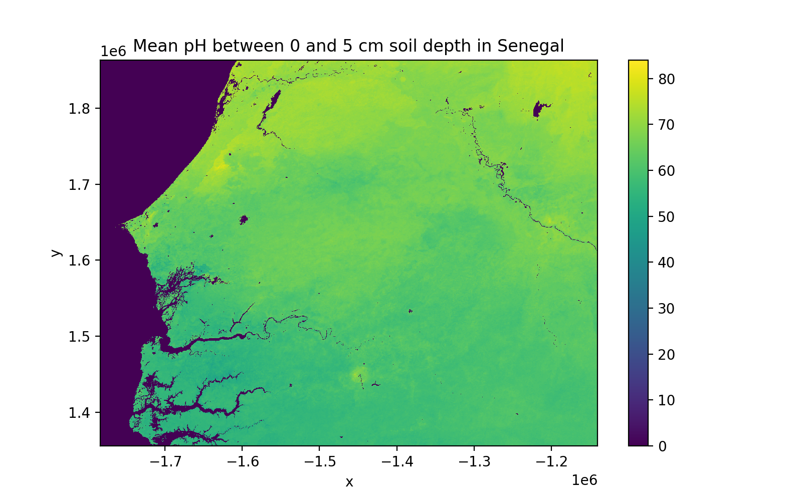

# soilgrids
[](https://soilgrids.readthedocs.io/en/latest/?badge=latest)
[](https://github.com/gantian127/soilgrids/blob/master/LICENSE.txt)
[](https://mybinder.org/v2/gh/gantian127/soilgrids/master?filepath=notebooks%2Fsoilgrids.ipynb)


Python library to fetch the global gridded soil information from [SoilGrids](https://www.isric.org/explore/soilgrids),
a system for global digital soil mapping to map the spatial distribution of soil properties across the globe.  

If you have any suggestion to improve the current function, please create a github issue 
[here](https://github.com/gantian127/soilgrids/issues).

## Get Started

#### Install package

##### Stable Release

The soilgrids package and its dependencies can be installed with pip.
```
$ pip install soilgrids
```

##### From Source

After downloading the source code, run the following command from top-level folder 
(the one that contains setup.py) to install soilgrids.
```
$ pip install -e .
```

#### Download SoilGrids Data
You can launch binder to test and run the code below.

##### Example 1: use SoilGrids class to download data (Recommended method)

```python
import matplotlib.pyplot as plt
from soilgrids import SoilGrids

# get data from SoilGrids
soil_grids = SoilGrids()
data = soil_grids.get_coverage_data(service_id='phh2o', coverage_id='phh2o_0-5cm_mean', 
                                       west=-1784000, south=1356000, east=-1140000, north=1863000,  
                                       crs='urn:ogc:def:crs:EPSG::152160',output='test.tif')

# show metadata
for key, value in soil_grids.metadata.items():
    print('{}: {}'.format(key,value))


# plot data
data.plot(figsize=(9,5))
plt.title('Mean pH between 0 and 5 cm soil depth in Senegal')
```



##### Example 2: use BmiSoilGrids class to download data (Demonstration of how to use BMI)

```python
import matplotlib.pyplot as plt
import numpy as np

from soilgrids import BmiSoilGrids


# initiate a data component
data_comp = BmiSoilGrids()
data_comp.initialize('config_file.yaml')

# get variable info
var_name = data_comp.get_output_var_names()[0]
var_unit = data_comp.get_var_units(var_name)
var_location = data_comp.get_var_location(var_name)
var_type = data_comp.get_var_type(var_name)
var_grid = data_comp.get_var_grid(var_name)
print('variable_name: {} \nvar_unit: {} \nvar_location: {} \nvar_type: {} \nvar_grid: {}'.format(
    var_name, var_unit, var_location, var_type, var_grid))

# get variable grid info 
grid_rank = data_comp.get_grid_rank(var_grid) 

grid_shape = np.empty(grid_rank, int)
data_comp.get_grid_shape(var_grid, grid_shape)

grid_spacing = np.empty(grid_rank)
data_comp.get_grid_spacing(var_grid, grid_spacing)

grid_origin = np.empty(grid_rank)
data_comp.get_grid_origin(var_grid, grid_origin)

print('grid_rank: {} \ngrid_shape: {} \ngrid_spacing: {} \ngrid_origin: {}'.format(
    grid_rank, grid_shape, grid_spacing, grid_origin))

# get variable data 
data = np.empty(grid_shape, var_type)
data_comp.get_value(var_name, data)

# get X, Y extent for plot
min_y, min_x = grid_origin
max_y = min_y + grid_spacing[0]*grid_shape[0]
max_x = min_x + grid_spacing[1]*grid_shape[1]
dy = grid_spacing[0]/2
dx = grid_spacing[1]/2
extent = [min_x - dx, max_x + dx, min_y - dy, max_y + dy]

# plot data
fig, ax = plt.subplots(1,1, figsize=(9,5))
im = ax.imshow(data, extent=extent)
fig.colorbar(im)
plt.xlabel('X')
plt.ylabel('Y')
plt.title('Mean pH between 0 and 5 cm soil depth in Senegal')
```

